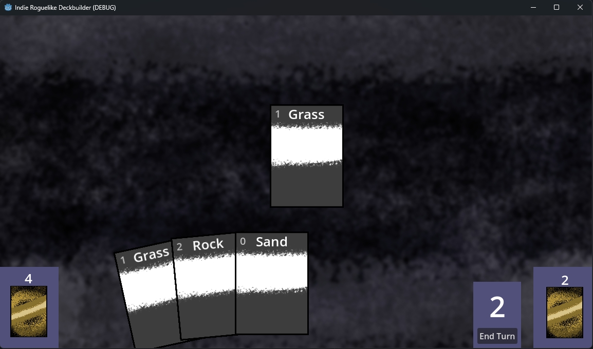

# Indie Roguelike Deckbuilder

This is quick little Godot 4 project I created to recreate the gameplay mechanics
of card games like _Slay the Spire_ and _Dominion_.

## Mechanics

There is a draw pile, hand, energy count, and discard pile.  Five cards
are drawn per turn. Click on cards to "play" them, which sends them to the discard pile.
This requires some energy, which is spent in doing so. You can also click the draw
pile to draw a card. Once your energy is spent, you can end the turn, discarding your
hand and drawing a new hand. Any time you draw cards and there aren't any left, your
discard pile is reshuffled to form a new draw pile.

## Asset Credits

- Sounds from [Casino Audio by kenney.nl](https://kenney.nl/assets/casino-audio)
- Background, card background, and card texture by me.
